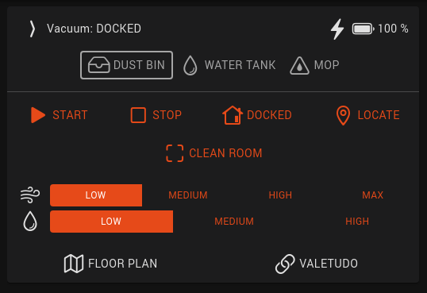
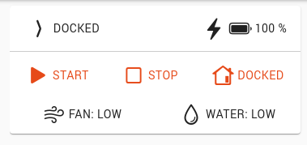

# openHAB 3 Widgets

This directory contains widgets for openHAB 3's new user interface.

They are **not** compatible with openHAB 2, with HabPanel or with other user interfaces.

## Installation

1. Copy the widget YAML content
2. From the sidebar, navigate to Developer Tools → Widgets and create a new widget
3. Paste the widget content and save

## Usage

### Add a widget to a page - standalone and cell

1. Navigate to Settings → Pages → [the page you want to modify]
2. Click
  - Add Cells to add a cell
  - Add Column, then the "+" symbol on the new column to add a standalone card
3. Select the newly created widget
4. Click the button on the top right of your widget and select Configure Cell or Configure Widget

### Set default item widgets

1. Find your vacuum's main item, either from Settings → Items or from Settings → Model
2. Click Add Metadata
3. Select Default Standalone/Cell Widget
4. Select the custom widget
5. Fill in the configuration details at the bottom of the page

## Widgets

### [`valetudo-standalone.yml`](./valetudo-standalone.yml)

- Standalone
- Card

Status information:

- Status
- Attachments
- Battery
- Fan speed
- Water grade
- Map (requires ICBINV)

Controls:

- Start, stop, pause, dock
- Locate
- Segment clean
- Set fan speed
- Set water grade

The widget is very configurable, most controls are optional and a lot of stuff can be disabled to
get a small widget.

It is not suitable for cells since the smallest size is still slightly large. It is also too tall for
sheet panels.

 

